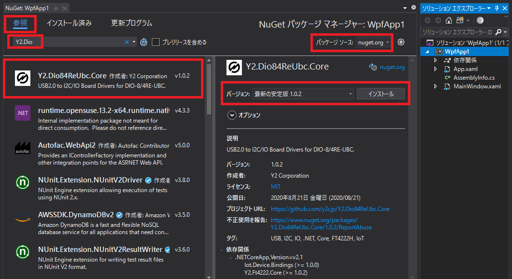

# USB-I2C変換ボード（絶縁デジタル入出力付） DIO-8/4RE-UBC用ドライバ

[USB-I2C変換ボード（絶縁デジタル入出力付） DIO-8/4RE-UBC](https://www.y2c.co.jp/i2c-r/dio-8-4re-ubc/) を制御する為のドライバです。  
Windows・Linux・Mac で使用できます。 

## セットアップ

1. Visual Studioで、プロジェクトを新規作成するか既存のプロジェクトを開きます。  
（.NET Coreに対応したプロジェクト）

2. NuGetパッケージの「Y2.Dio84ReUbc.Core」をインストールします。  

    * ソリューションエクスプローラーからプロジェクトを右クリックして「NuGetパッケージの管理」をクリックします。  
    * タブを「参照」にして、パッケージソースを「nuget.org」にします。  
    * 検索窓に「Y2.Dio」を入力すると「Y2.Dio84ReUbc.Core」が見つかりますので選択します。  
    * バージョンは「最新の安定版」にして「インストール」をクリックします。

    

3. FTDI社のライブラリ（デバイスドライバ含む）を以下の各OSの手順にしたがってインストールします。

    （本製品は、USB-I2C変換にFTDI社のデバイス（FT4222H）を使用しているため必要です）  

    Windows 64bit

    * [FT4222Hの製品ページ](https://www.ftdichip.com/Products/ICs/FT4222H.html) から「LibFT4222 Windows Library」をダウンロードして解凍します。  
    * ```LibFT4222-vx.x.x\imports\LibFT4222\lib\amd64\LibFT4222-64.dll``` をアプリケーションの実行可能ファイルと同じディレクトリにコピーします。  
    * ```LibFT4222-64.dll``` を ```LibFT4222.dll``` に名前を変更します。  

    （レジストリ登録やPATHで登録しても可）

    Windows 32bit

    * [FT4222Hの製品ページ](https://www.ftdichip.com/Products/ICs/FT4222H.html) から「LibFT4222 Windows Library and Examples」をダウンロードして解凍します。  
    * ```LibFT4222-vx.x.x\imports\LibFT4222\lib\i386\LibFT4222.dll``` をアプリケーションの実行可能ファイルと同じディレクトリにコピーします。  

    （レジストリ登録やPATHで登録しても可）

    Linux

    * [FT4222Hの製品ページ](https://www.ftdichip.com/Products/ICs/FT4222H.html) から「LibFT4222 Linux Library and Examples」をダウンロードして解凍します。  
    * 管理者権限で ```install4222.sh``` を実行します。  

    Mac

    * [D2XX Driversのダウンロード](https://www.ftdichip.com/Drivers/D2XX.htm) から ```libftd2xx.dylib``` をダウンロードして解凍します。  
    * [FT4222Hの製品ページ](https://www.ftdichip.com/Products/ICs/FT4222H.html) から「LibFT4222 MAC OSX Library and Examples」をダウンロードして解凍します。  
    * ターミナルで以下のコマンドを実行します。  

        ```bash
        # /usr/local/libディレクトリがなければ作成
        $ sudo mkdir /usr/local/lib
        # /usr/local/includeディレクトリがなければ作成
        $ sudo mkdir /usr/local/include
        # libftd2xx.1.4.16.dylibが解凍されたパスに移動してから
        # ファイルをコピー
        $ sudo cp libftd2xx.1.4.16.dylib /usr/local/lib/libftd2xx.1.4.16.dylib
        # シンボリックリンクを作成
        $ sudo ln -sf /usr/local/lib/libftd2xx.1.4.16.dylib /usr/local/lib/libftd2xx.dylib
        # libft4222.1.4.4.14.dylibが解凍されたパスに移動してから
        # ファイルをコピー
        $ sudo cp libft4222.1.4.4.14.dylib /usr/local/lib/libft4222.1.4.4.14.dylib
        # シンボリックリンクを作成
        $ sudo ln -sf /usr/local/lib/libft4222.1.4.4.14.dylib /usr/local/lib/libft4222.dylib
        # ファイルをコピー
        $ sudo cp boost_libs/libboost_system.dylib /usr/local/lib/libboost_system.dylib
        $ sudo cp boost_libs/libboost_thread-mt.dylib /usr/local/lib/libboost_thread-mt.dylib
        ```

## 使用方法

```csharp
// DIO-8/4RE-UBCのインスタンスを生成。I2Cクロック周波数は400kHz。
var dio84Re = new Dio84Re(400);

// DIO-8/4RE-UBCを初期化
dio84Re.Initialize();

// IN2の状態を読み出し
var in2 = dio84Re.ReadPin(2);

// IN7～0を読み出し
var in7_0 = dio84Re.ReadPort();

// OUT2をONに設定
dio84Re.WritePin(2, PinState.On);

// OUT3をON, OUT2をOFF, OUT1をON, OUT0をOFFに設定
dio84Re.WritePort(0x0a);
```

[I2C アナログ入力ボード AIO-32/0RA-IRC](https://www.y2c.co.jp/i2c-r/aio-32-0ra-irc/) をスタックして使用する場合

```csharp
// DIO-8/4RE-UBCのインスタンスを生成。I2Cクロック周波数は400kHz。
var dio84Re = new Dio84Re(400);

// DIO-8/4RE-UBCを初期化
dio84Re.Initialize();

// AIO-32/0RA-IRCのインスタンスを生成。I2CマスターはDIO-8/4RE-UBC。
var aio320 = new Aio320(dio84Re);

// AIO-32/0RA-IRCを初期化
aio320.Initialize();

// アナログ値の読み出し（電圧）。データレートは128SPS。入力電圧範囲は10V
var volts = aio320.ReadVoltage(0, 32, Aio320.DataRate.Sps128, Aio320.Pga.Fs10035mV);
```

Microsoft の Iot.Device のI2Cデバイスに渡して使用する事もできます。

```csharp
// DIO-8/4RE-UBCのインスタンスを生成。I2Cクロック周波数は400kHz。
var dio84Re = new Dio84Re(400);

var bno055Sensor = new Bno055Sensor(dio84Re);

Console.WriteLine($"Id: {bno055Sensor.Info.ChipId}, AccId: {bno055Sensor.Info.AcceleratorId}, GyroId: {bno055Sensor.Info.GyroscopeId}, MagId: {bno055Sensor.Info.MagnetometerId}");
Console.WriteLine($"Firmware version: {bno055Sensor.Info.FirmwareVersion}, Bootloader: {bno055Sensor.Info.BootloaderVersion}");
Console.WriteLine($"Temperature source: {bno055Sensor.TemperatureSource}, Operation mode: {bno055Sensor.OperationMode}, Units: {bno055Sensor.Units}");
Console.WriteLine($"Powermode: {bno055Sensor.PowerMode}");
```

## 使用例

* [DIO-8/4RE-UBCの使用方法（Windows）](https://www.y2c.co.jp/i2c-r/dio-8-4re-ubc/netcore/)  
* アナログ入力32点を増設する → [AIO-32/0RA-IRCの使用例へ](https://www.y2c.co.jp/i2c-r/aio-32-0ra-irc/windows/)  
* 絶縁デジタル出力16点を増設する → [DIO-0/16RC-IRCの使用例へ](https://www.y2c.co.jp/i2c-r/dio-0-16rc-irc/windows/)  
* 絶縁デジタル入力8点・絶縁デジタル出力4点を増設する → [DIO-8/4RD-IRCの使用例へ](https://www.y2c.co.jp/i2c-r/dio-8-4rd-irc/windows/)  
* [DCモーターを制御する](https://www.y2c.co.jp/i2c-r/dio-8-4re-ubc/adafruit2348/)  
* [OLEDディスプレイを制御する](https://www.y2c.co.jp/i2c-r/dio-8-4re-ubc/mikroe1649/)  

## 関連プロジェクト

* [Y2.Ft4222.Core](https://github.com/y2cjp/Y2.Ft4222.Core)  
  USB-I2C変換ボード用ドライバ

* [DIO-8-4RE-UBC-ExampleCs](https://github.com/y2cjp/DIO-8-4RE-UBC-ExampleCs)  
  [USB-I2C変換ボード（絶縁デジタル入出力付） DIO-8/4RE-UBC](https://www.y2c.co.jp/i2c-r/dio-8-4re-ubc/) 用サンプル
